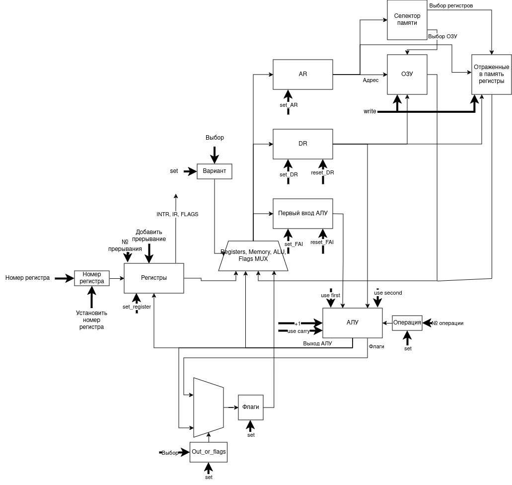

# RISC процессор. Транслятор и модель

- Козодой Андрей Сергеевич, P3216
- `asm | risc | neum | hw | instr | binary -> struct | trap -> stream | mem | cstr | prob2 | cache`

## Язык программирования ASM

``` ebnf
<program> ::= <instruction>*

<instruction> ::= <label>?: <operation>

<label> ::= <identifier>

<operation> ::= <mnemonic> <operand>*

<mnemonic> ::= <identifier>

<operand> ::= <register> | <immediate> | <label>

<register> ::= <identifier>

<immediate> ::= <number>

<identifier> ::= <letter> | <letter><identifier>

<letter> ::= a | b | c | ... | z | A | B | C | ... | Z

<number> ::= <digit> | <digit><number>

<digit> ::= 0 | 1 | 2 | ... | 9
```

Код выполняется последовательно.

Инструкции процессора:
- NOP -  Заглушка
- MOV -  Скопировать содержимое регистра в другой
- LDR -  Загрузить в регистр содержимое памяти
- STR -  Сохранить в память содержимое регистра
- PUSH - Сохранить содержимое регистра на стек
- POP - Записать со стека значение в регистр
- B -  Переход на метку (относительно регистра PC)
- BL -  Переход метку с ссылкой
- BX -  Переход на адрес из регистра
- BLX -  Переход на адрес из регистра с ссылкой
- AND - Побитовое И
- OR - Побитовое ИЛИ
- NOT - Побитовое НЕ
- NEG - Отрицание
- ADD - Сумма
- SUB - Разница
- MUL - Умножение
- DIV - Деление
- LS -  Логический сдвиг влево
- RS -  Логический сдвиг вправо
- HALT -  Останов
- INT -  Вызвать прерывание
- CMP - Сравнение
- ExINT -  Выйти из прерывания
Инструкции транслятора:
- word - зарезервировать в памяти место под машинное слово
- string - зарезервировать и записать в память строку (1 символ = 1 машинное слово)
- org - задать смещение относительно начала файла
- words - зарезервировать место под несколько слов

Память выделяется статически, при запуске модели. Видимость данных -- глобальная.

## Организация памяти

16 регистров (R0-R10, LR, SP, PC, INTR, IR)

Модель памяти процессора:
| Адрес | Содержимое   |
|:-----|:-------------|
|0| Переход к _start|
|1-32| Инструкции прерываний (1 инструкция на прерывание)|
||Данные и команды|

Памяти команд и данных совмещены.
Память имеет линейное адресное пространство. Реализуется списком чисел. Размер слова - 8 бит.

- Выделяется статически, при запуске модели
- Нет разделения памяти на командную и данных
- Глобальная видимость данных
- Представлена в виде массива строк, размерностью 1000
- Cлово команды является 32-битным двоичным числом
- Адресация происходит по обращению по индексу массива
- Программа отображается на память, начиная с адреса 0
- Программисту доступны операции с любой памятью
- Числовые и строчные литералы хранятся по адресу, занятому при загрузке программы
- Строки хранятся в Си-формате, массивом символов, где последней записью является 0. Каждый символ хранится в одном машинном слове (32 бита)
- Адресация по значению в выбранном регистре или относительно PC.

## Система команд

Особенности процессора:

- Машинное слово -- 32 бит, знаковое.
- Доступ к памяти данных осуществляется по адресу, хранящемуся в указанном в инструкции регистре или относительно PC.
- Поток управления:
    - инкремент `PC` после каждой инструкции;
    - безусловный (`b`), (`bl`), (`bx`), (`blx`) переходы. Условность достигается благодаря использованию флагов условного выполнения.
- Система прерываний:
    - 32 прерывания
    - Прерывания выполняются последовательно (приоритетность - прерывание, номер которого ближе к 0)

### Набор инструкций

| Инструкция   | Кол-во тактов | Описание                                                    |
|:-------------|:--------------|:------------------------------------------------------------|
| NOP |  0  | Заглушка |
| MOV |  4  | Скопировать содержимое регистра в другой |
| LDR |  4  | Загрузить в регистр содержимое памяти |
| STR |  5  | Сохранить в память содержимое регистра |
| PUSH |  14  | Сохранить содержимое регистра на стек |
| POP |  16  | Записать со стека значение в регистр |
| B |  6  | Переход на метку (относительно регистра PC) |
| BL |  10  | Переход метку с ссылкой |
| BX |  4  | Переход на адрес из регистра |
| BLX |  8  | Переход на адрес из регистра с ссылкой |
| AND |  7-9  | Побитовое И |
| OR |  7-9  | Побитовое ИЛИ |
| NOT |  3  | Побитовое НЕ |
| NEG |  4  | Отрицание |
| ADD |  7-8  | Сумма |
| SUB |  9-10  | Разница |
| MUL |  7-8  | Умножение |
| DIV |  7-8  | Деление |
| LS |  7-8  | Логический сдвиг влево |
| RS |  7-8  | Логический сдвиг вправо |
| HALT |  1  | Останов |
| INT |  12  | Вызвать прерывание |
| CMP |  9-10  | Сравнение |
| ExINT |  20  | Выйти из прерывания |

### Кодирование инструкций

- Машинный код сериализуется в двоичный код
- Одна инструкция -- 4 байта
- Индекс списка -- адрес инструкции. Используется для команд перехода.

## Транслятор

Интерфейс командной строки: `translator.py <input_file> <output_file>`

Реализовано в модуле: [translator](./translator.py)

Этапы трансляции (функция `translate`):

1. Трансформирование текста в последовательность инструкций и данных.
2. Линковка

Правила генерации машинного кода:

- одна строка -- одна инструкция
- прямое отображение команд;

Примечание: вопросы отображения переменных на регистры опущены из-за отсутствия оных.

## Модель процессора

Интерфейс командной строки: `machine.py <machine_code_file> <input_file>`

Реализовано в модуле: [machine](./machine.py).

### DataPath


Реализован в классе `DataPath`.

`ОЗУ` -- двупортовая память, поэтому входов для чтения и записи два.

Сигналы (обрабатываются за один такт, реализованы в виде методов класса):

- `select_register` -- установить номер регистра
- `set_regiser` -- записать значение из АЛУ в регистр
- `write` -- записать выбранное значение в память
- `select_registers_memory_alu_or_flags` -- выбор входа для регистров FAI, DR, AR
- `add_interruption` - добавить прерывание
- `set_first_ALU_input`- установить значение регистру FAI
- `set_DR`- установить значение регистру DR
- `reset_first_ALU_input`- сбросить значение регистру FAI
- `reset_DR`- сбросить значение регистру DR
- `set_AR`- установить значение регистру AR
- `(re)set_use_first_ALU_input` - (не) использовать первый вход АЛУ для выполнения операции
- `(re)set_use_second_ALU_input` - (не) использовать второй вход АЛУ для выполнения операции
- `write` - записать в память содержимое DR
- `(re)set_plus_1` - (не) прибавлять единицу к результату сложения
- `(re)set_use_carry` - (не) прибавлять единицу к результату сложения, если установлен флаг переноса
- `set_ALU_operation` - выбор операции АЛУ


Флаги:

- `z` -- отражает наличие нулевого значения на выходе АЛУ.
- `c` -- отражает наличие переноса из старшего бита.
- `n` -- отражает наличие отрицательного значения на выходе АЛУ.

### ControlUnit

``` text
                                                 +---------+
                                                 |  step   |
                                             +---| counter |
                                             |   +---------+
                                             v        ^
                                  +-------------+     |
                                  | instruction |-----+
                                  |   decoder   |
                                  |             |<---------------+
                                  +-------------+                |
                                          |                      |
                                          | signals              |
                                          v                      |
                                    +----------+  INTR,IR,Flags  |
                                    |          |-----------------+
                                    | DataPath |
                     INTR --------->|          |
                                    +----------+
```

Реализован в классе `ControlUnit`.

- Hardwired (реализовано полностью на Python).
- Метод `execute_one_instruction` моделирует выполнение полного цикла инструкции.
- `step_counter` необходим для многотактовых инструкций;
    - в реализации класс `ControlUnit` отсутствует, т.к. неявно задан потоком управления.

Особенности работы модели:

- Цикл симуляции осуществляется в функции `simulate`.
- Шаг моделирования соответствует одной инструкции с выводом состояния в журнал.
- Для журнала состояний процессора используется модуль `logging`.
- Количество инструкций для моделирования не лимитировано.
- Остановка моделирования осуществляется при:
    - выполнении инструкции `halt`.
    - обращении к несуществующему адресу.

## Тестирование

Тестирование выполняется при помощи golden test-ов.

1. Тесты реализованы в: [golden.py](./golden.py). Конфигурации:
    - [golden/cat.yml](golden/cat.yml)
    - [golden/helloworld.yml](golden/helloworld.yml)
    - [golden/hello_user_name.yml](golden/hello_user_name.yml)


Запустить тесты: `pytest golden.py`

CI при помощи Github Action:

``` yaml
name: CI
on:
    push:
      branches: [ "main" ]
    pull_request:
      branches: [ "main" ]
jobs:
  test:
    runs-on: ubuntu-latest

    steps:
      - name: Checkout code
        uses: actions/checkout@v4

      - name: Set up Python
        uses: actions/setup-python@v4
        with:
          python-version: '3.10'

      - name: Install dependencies
        run: |
          python -m pip install --upgrade pip
          pip install pytest
          pip install pytest-golden

      - name: Run tests
        run: |
          pytest golden.py
        env:
          CI: true

  lint:
    runs-on: ubuntu-latest

    steps:
      - name: Checkout code
        uses: actions/checkout@v4

      - name: Set up Python
        uses: actions/setup-python@v4
        with:
          python-version: '3.10'

      - name: Install dependencies
        run: |
          python -m pip install --upgrade pip
          pip install ruff

      - name: Check code formatting with Ruff
        run: ruff format --check .

      - name: Run Ruff linters
        run: ruff check .
```

где:

- `pytest` -- утилита для запуска тестов.
- `ruff` -- утилита для форматирования и проверки стиля кодирования.

Пример использования и журнал работы процессора на примере `cat`:

``` shell
$ cat foo
foo
$ cat cat.asm
b =_start
b =_int_handler
out_register: word 0xfffffc
in_register: word 0xfffffd
_start:
    b =_start
_int_handler:
    push r0
    push r1
    push r2

    ldr r0, [=in_register]
    ldr r1, [=out_register]
    ldr r2, [r0]
    cmp r2, 0
    haltz
    str r2, [r1]
    or r2, -1
    str r2, [r0]

    pop r2
    pop r1
    pop r0
    exint
$ python translator.py cat.asm cat
$ python machine.py cat foo
foo
Выполнено тактов: 1992
```

Пример проверки исходного кода:

``` shell
$ pytest golden.py
=============================== test session starts ============================
platform linux -- Python 3.10.12, pytest-8.2.1, pluggy-1.5.0
rootdir: /home/andrey/ИТМО/АК
plugins: golden-0.2.2
collected 3 items                                                                      

golden.py ...                                                             [100%]

=============================== 3 passed in 0.35s ==============================
$ poetry run ruff check .
All checks passed!
$ poetry run ruff format .
4 files left unchanged
```

```text
| ФИО                      |       алг       | LoC | code байт | code инстр. | инстр. | такт. |
| Козодой Андрей Сергеевич |   helloworld    |  31 | 160       |      25     | 198    | 3817  |
| Козодой Андрей Сергеевич |        cat      | 24  |    80     |    18       | 75     | 1992  |
| Козодой Андрей Сергеевич | hello_user_name | 80  |    444     |    62       | 2031   | 39622 |
| Козодой Андрей Сергеевич |      prob2      | 24  |    76     |    16       | 346   | 6947 |
```